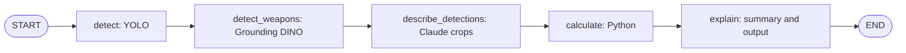
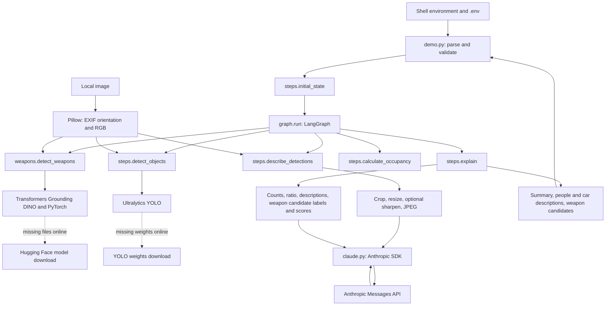

# Architecture: image analysis with LangGraph

The CLI analyzes one local still image. LangGraph orchestrates every processing
stage. YOLO detects vehicles and people; Grounding DINO detects weapon candidates;
Claude describes car/person crops and summarizes evidence; Python calculates the
vehicle-to-capacity ratio and formats the final answer.

## Runtime graph



```text
START → detect → detect_weapons → describe_detections → calculate → explain → END
```

Five application nodes and six unconditional edges are registered in
[graph.py](graph.py). `StateGraph(State)` defines the state contract; `add_node`
registers a Python callable, `add_edge` determines its successor, and `compile()`
builds the executable graph. Importing the module compiles the graph without
running models. `run(state)` invokes it synchronously once.

Every successful online or offline run follows this path. Offline decisions
happen inside nodes. There are no dynamic per-object nodes, parallel branches,
agent tool loops, checkpoints, persistence, or automatic failure-recovery edges.
The description node makes sequential calls inside its loop. The LLM does not
choose which node runs next.

## Components and data boundaries



The component arrows describe calls/dependencies, not graph scheduling. Images
are processed locally by both detectors. Online Claude requests receive only
car/person crop JPEGs and text evidence, never a separately attached full-scene
image. A crop can nevertheless include background, overlapping objects, or much
of the source image. Grounding DINO uses local inference; model downloads do not
upload the input image.

## Repository map

| File | Responsibility |
| --- | --- |
| [demo.py](demo.py) | Loads `.env`, parses arguments, validates credentials/offline YOLO weights, invokes graph, prints trace and answer. |
| [graph.py](graph.py) | Five nodes, six edges, compiled graph, `run()`. |
| [steps.py](steps.py) | State types, initialization, YOLO detection, crop descriptions, arithmetic, summary projection, output formatting. |
| [weapons.py](weapons.py) | Grounding DINO loader, inference helper, filtering and duplicate suppression, `detect_weapons` node. |
| [claude.py](claude.py) | Class/summary prompts, native Anthropic messages, text extraction and API errors. |
| [pyproject.toml](pyproject.toml), [uv.lock](uv.lock) | Dependency declarations and resolved versions. |
| [.env.example](.env.example) | API/model environment template. |
| [sample_images/README.md](sample_images/README.md) | Sample sources and limitations. |
| `test_workflows.py`, `test_weapons.py`, `test_descriptions.py`, `test_claude.py`, `test_cli.py` | Graph, detector boundary, image processing, SDK payload, and CLI tests. |

Direct dependencies are LangGraph, Anthropic, Ultralytics, Pillow, Transformers,
PyTorch, and python-dotenv. Application code and tests do not import LangChain;
`langchain-core` remains a transitive LangGraph dependency.

## State and updates

`State` is a `TypedDict`, passed at runtime as a dictionary. Nodes return partial
updates; other fields are retained. There are no custom reducers. Each node
explicitly copies and extends `trace`; lists otherwise replace earlier values.
API credentials, model objects, decoded images, tensors, and JPEG bytes are not
stored in graph state. Each run starts with fresh state; loaders cache models
inside the process.

| Fields | Initial value/source | Writer / consumer |
| --- | --- | --- |
| `question`, `image_path` | Stripped question, resolved local path | CLI initialization; descriptions/summary and local decoding |
| `parking_capacity` | Positive integer or `None` | Initialization; calculation |
| `yolo_model`, `confidence` | `yolo26x.pt`, `0.25` | Initialization; YOLO |
| `dino_model` | `IDEA-Research/grounding-dino-tiny` | Initialization; Grounding DINO |
| `weapon_threshold`, `weapon_text_threshold` | `0.35`, `0.25` | Initialization; box and text filtering |
| `use_llm`, `model` | Online flag; CLI/environment Claude model | Description and explanation; also controls DINO download permission |
| `sharpen_crops` | `False` | Crop description node |
| `detections`, `counts` | `[]`, `{}` | YOLO; description/calculation nodes |
| `weapon_detections` | `[]` | Grounding DINO; summary and output |
| `descriptions` | `[]` | Crop description node; summary/output |
| `total`, `occupancy` | `0`, `None` | Calculation; explanation |
| `answer`, `trace` | `''`, `[]` | Explanation; all nodes append trace events |

Both detector record types contain `label`, `confidence`, and `xyxy` coordinates
in the EXIF-oriented source image. The lists remain separate. Weapon labels are
text phrases returned by Grounding DINO, not a fixed numeric class ID or a
verified classification. Crop descriptions contain `label`, class-specific
`object_id` (starting at 1), `detection_index` (zero-based in the retained YOLO
list), integer crop bounds, and description text.

## Nodes and helper work

### 1. `detect` → `steps.detect_objects`

Reads the local image, applies EXIF orientation and RGB conversion, loads YOLO
lazily (`lru_cache(maxsize=2)`), and runs `predict(..., save=False)`. Retains cars,
trucks, buses, motorcycles, and people at the configured confidence threshold.
Writes detections, counts with all supported keys, and a trace event. Other YOLO
classes are discarded. No annotated output image is saved.

### 2. `detect_weapons` → `weapons.detect_weapons`

Reads the full local image with the same orientation as YOLO. Runs even if YOLO
found no people, and runs offline as well as online. It does not use person crops
or associate a weapon candidate with a person.

`load_grounding_dino()` loads a compatible processor and zero-shot object detector
through Transformers, caches up to two `(model_id, local_files_only, device)` combinations,
and sets evaluation mode. `devices.resolve_device()` selects MPS when available,
then CUDA, then CPU, or validates an explicit `--device` selection. Both YOLO
and Grounding DINO receive this device; the CLI prints it before inference.
`predict_weapons()` runs under `torch.inference_mode()` with this prompt:

```text
handgun. rifle. shotgun. knife.
```

Postprocessing uses the configured box and text thresholds and original
`(height, width)` to recover pixel boxes. The node validates finite scores and
boxes, clips boxes to image bounds, discards empty boxes/labels and low scores,
then sorts by descending score. Class-independent non-maximum suppression removes
candidates with IoU greater than `0.5` against a retained box. This reduces
multiple phrase matches but may merge overlapping distinct objects.

Writes `weapon_detections` and a trace event. It never alters YOLO counts or
parking arithmetic. These are unverified weapon candidates, not calibrated
probabilities, confirmed weapons, or evidence of ownership/intent. An empty list
means nothing passed the thresholds, not that the scene is weapon-free. Small,
occluded, or ambiguous objects may be missed. This model has not been validated
for weapon detection on the repository's images.

Integration reference: [Grounding DINO in Transformers](https://huggingface.co/docs/transformers/model_doc/grounding-dino).

### 3. `describe_detections` → `steps.describe_detections`

Offline or with no car/person detections, returns an empty list plus a skip trace.
Otherwise reopens the oriented image and processes each car/person in YOLO order:
validates bounds, floors left/top and ceils right/bottom, clips to the image,
crops, resizes to fit 768 × 768, and encodes a quality-85 JPEG in memory.
Optional sharpening adds a second JPEG of the same crop using
`UnsharpMask(radius=1.2, percent=125, threshold=3)`.

Claude receives the class prompt and crop(s) in one request per object. Car text
covers visible appearance; person text covers clothing, posture, and observable
activity. Claude is instructed not to issue armed/unarmed or gun-visibility
verdicts; the separate DINO node supplies weapon candidates. Writes descriptions
and trace only after the entire sequential loop succeeds.

### 4. `calculate` → `steps.calculate_occupancy`

Sums only cars, trucks, buses, and motorcycles. People and weapon candidates do
not contribute. With supplied capacity: `occupancy = total / capacity * 100`.
Without capacity: `None`. Capacity must be a positive integer, excluding bools.
Values over 100% are retained and flagged. This is a detection-to-capacity ratio,
not a measured occupied-space count or a claim about available parking spaces.

### 5. `explain` → `steps.explain`

Online: `statistics()` projects counts, vehicle total, capacity, ratio,
car/person description text and IDs, and weapon candidate labels/scores into the
summary evidence. Image paths, detector boxes, and YOLO confidence scores are
omitted. Claude receives this evidence plus the user question. It is instructed
to preserve uncertainty and not assign weapon candidates to people.

Offline: Python creates the statistical summary. Online output additionally
appends person descriptions followed by car descriptions. In both modes Python
appends the Grounding DINO candidate list with scores and pixel boxes, or an
explicit no-candidates-above-thresholds message, plus detection limitations.
Writes answer and final trace event. Weapon evidence is always displayed even
if the language model summary omits it.

## Anthropic calls

Each helper request creates an `Anthropic(timeout=60, max_retries=2)` client in a
context manager. `messages.create` receives a separate `system` parameter and one
native user message. Temperature is zero; output limits are 300 tokens per crop
and 1200 for the summary. Text response blocks are joined and stripped; non-text
blocks are ignored and empty text fails. The client closes after each call.

Online logical request count is number of detected cars + people + one summary.
DINO adds no Claude requests. Sharpening sends two images in each affected request,
not two separate requests. Retries may increase HTTP request count and duration;
the 60-second timeout is not a deadline for the complete graph.

## Configuration, offline mode, and failures

`--model` overrides `ANTHROPIC_MODEL`, which overrides the code default
`claude-sonnet-4-6`. Shell environment overrides `.env` next to `demo.py`.
`--dino-model` accepts a compatible Hugging Face model ID or a local directory;
`--weapon-threshold` and `--weapon-text-threshold` must be in `(0, 1]`.

Online first use may download both detector models. `--offline` skips Claude,
requires an existing YOLO weights file in CLI validation, and loads Grounding
DINO with `local_files_only=True`. Cached DINO files or a complete local model
and processor directory are required; missing files cause an error. Direct Python
callers arrange environment loading and local YOLO weights themselves.

| Failure | Behavior |
| --- | --- |
| Invalid input, thresholds, missing CLI credentials/YOLO weights | CLI validation fails before graph invocation. |
| Decode/YOLO failure | Runtime error; no later nodes execute. |
| DINO load/inference/invalid-result failure | Runtime error; offline file-loading errors include cache/local-directory guidance. No descriptions or summary execute. |
| Invalid crop or Claude description failure | Stops the graph; earlier crop requests may already have occurred. |
| Claude authentication/rate-limit/API failure or empty text | Readable runtime error; no automatic offline fallback. |
| Runtime/value error during graph invocation | CLI exits with status 1; final trace/answer are not printed. |

## Example state progression

For hypothetical detections of two cars, one truck, two people, and one DINO
knife candidate, with capacity 10:

| Stage | State change |
| --- | --- |
| Initialize | Empty result lists/counts, `total=0`, `occupancy=None`. |
| YOLO | Five retained detections and class counts; one trace event. |
| DINO | One weapon candidate; two trace events. |
| Describe online | Four crop descriptions; three trace events. |
| Calculate | `total=3`, `occupancy=30.0`; four trace events. |
| Explain | Summary, person/car descriptions, and weapon candidate list; five trace events. |

This online example makes five logical Claude requests. Offline makes none but
still runs both detectors and includes weapon candidates in the output.

## Inspect and test

```sh
uv run python -c "from graph import graph; print(graph.get_graph().draw_mermaid())"
uv run python -m unittest -v
```

Tests run real LangGraph and Pillow processing with mocked model inference/API
calls. They cover state updates, graph order, independent weapon detection,
orientation, clipping, duplicate suppression, thresholds, SDK payloads, arithmetic,
offline behavior, and failure propagation. They do not establish real detector
accuracy or Claude factual reliability.

To add a stage, register a callable and replace the relevant direct edge with two
edges through the new node. New state fields need initialization and explicit
updates. Future parallel writers need reducers; the current sequential workflow
does not. The development codebase knowledge graph describes source symbols and
calls and is separate from these runtime LangGraph nodes.
