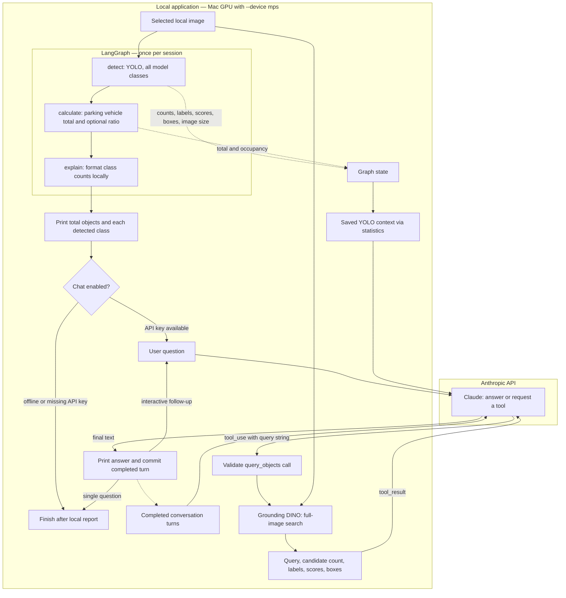

# Image-query architecture

YOLO runs once on the selected local image and saves detections for every class
supported by its weights. The terminal reports the detected classes and counts.
Claude then answers questions from those saved results or requests a Grounding
DINO search of the full image. Both detectors run locally on the selected device;
Claude runs through the Anthropic API.

## Runtime and data flow



The compiled LangGraph has exactly this path:

```text
START → detect → calculate → explain → END
```

Here `explain` formats a deterministic report; it makes no LLM request. After the
compiled graph returns, `demo.py` manages the terminal session and
`ImageConversation.ask()` manages Claude's tool loop. DINO is not a mandatory
graph node. There is no automatic weapon scan or image-description stage.

## Components

| File | Responsibility |
| --- | --- |
| [demo.py](demo.py) | Load `.env`, parse flags, select a device, run counting once, print results, then handle one question or interactive chat. |
| [graph.py](graph.py) | Compile and invoke the LangGraph counting pipeline. |
| [steps.py](steps.py) | Define state, run YOLO, retain all classes, calculate the parking ratio, format the report, and build Claude's YOLO context. |
| [devices.py](devices.py) | Select MPS, CUDA, or CPU; reject unavailable explicitly requested accelerators. |
| [claude.py](claude.py) | Define `query_objects` for Claude, retain conversation history, execute tool requests, and handle API errors. |
| [dino.py](dino.py) | Load Grounding DINO lazily, search the full image for a text query, and validate/filter candidates. |

## State and lifetime

Graph state is created for one image and passed to `ImageConversation` after
counting. It retains all accepted YOLO detections, not only cars and people.
The class list comes from `result.names`; the default `yolo26x.pt` has 80 classes,
and custom weights may define a different list.

| Stored value | Contents | Available to Claude? |
| --- | --- | --- |
| `counts` | A count for every model class, including zero counts. | Yes |
| `detections` | Each accepted detection's `label`, `confidence`, and `xyxy` box. | Yes |
| `image_size` | EXIF-oriented `width` and `height`. | Yes |
| `total` | Sum of car, truck, bus, and motorcycle counts only. | Yes |
| `parking_capacity`, `occupancy` | Supplied capacity and calculated ratio, or `None` when unknown. | Yes |
| `image_path` | Resolved path of the selected image. | No |
| Model IDs, device, thresholds, `use_llm` | Local inference and conversation configuration. | No |
| `question`, `answer`, `trace` | Initial question, local report, and graph execution events. | Follow-up questions are sent separately; the local report and trace are not sent. |

`statistics()` selects the YOLO evidence. `ImageConversation` serializes that
evidence into its system context once at session creation and sends it on every
API request. Follow-up questions therefore reuse the original detections without
rerunning YOLO.

Conversation history is separate from LangGraph state: `ImageConversation.messages`
retains completed user/assistant turns, tool requests, and DINO results. DINO
results do not overwrite YOLO counts or detections. A failed turn is not committed.
State and history live in memory and are lost when the application exits.

Both detectors use coordinates in the EXIF-oriented image. `xyxy` means
`[left, top, right, bottom]` in pixels, with the origin at the top-left. These boxes
and image dimensions support approximate location questions, but do not reveal
colors, clothing, identity, or object ownership.

## Detection and reporting

YOLO runs on the full image at the configured confidence threshold. Every accepted
class is retained with its score and box. The report prints the total number of
objects, the number of classes detected, and an alphabetical count for each
nonzero class. Zero counts remain available in state and Claude's context.

The CCTV sample produced this class summary on MPS with the default weights and
threshold:

```text
YOLO: 7 object(s) across 3 detected class(es).
  car: 2
  person: 3
  truck: 2
```

The parking vehicle total remains separate from the total number of objects.
Only cars, trucks, buses, and motorcycles contribute to it; bicycles, people,
backpacks, and other classes do not. With a supplied capacity, the ratio is
`parking vehicle total / capacity × 100`. Missing capacity produces unknown
occupancy. Ratios above 100% are flagged instead of clamped.

## Conversation and tool calls

Claude is instructed to use saved YOLO results for every detected class. It can
request DINO for unsupported classes, objects missing from the saved detections,
or an additional search requested by the user. Questions specifically about
what YOLO found use the saved results, including zero counts.

```mermaid
sequenceDiagram
    actor User
    participant App as ImageConversation
    participant Claude as Claude API
    participant DINO as Local Grounding DINO
    User->>App: Ask about the selected image
    App->>Claude: Saved YOLO results + history + question + tool schema
    alt Saved results are sufficient
        Claude-->>App: Answer from YOLO results
    else Additional object search
        Claude-->>App: tool_use: query_objects(query)
        App->>DINO: Query + bound full image + configured device
        DINO-->>App: Candidate labels, scores, boxes and count
        App->>Claude: tool_result matched by tool_use_id
        Claude-->>App: Answer, or another bounded tool request
    end
    App->>App: Commit completed turn to history
    App-->>User: Print final answer
    Note over App,DINO: Follow-ups reuse YOLO results; DINO searches the full image, not YOLO crops
```

The tool accepts only a `query` string of up to 200 characters, containing at least
one letter or number. Short object names such as `bicycle. backpack.` work as
prompts. The app adds a trailing period. The tool cannot select another image,
model, device, or threshold. Detection always uses the image path bound to state.

DINO's processor resizes the full image internally; it does not crop to YOLO boxes.
The model runs in evaluation and inference modes. Postprocessing recovers pixel
boxes, checks finite scores and valid bounds, clips to the image, and suppresses
same-label duplicates at IoU above 0.5. Overlapping different classes are retained.
A known empty-label/empty-box mismatch in Transformers is handled as zero
candidates; malformed nonempty results still fail validation.

A tool result contains `query`, `count`, `detections`, and an uncertainty `note`.
Multiple tool calls in one Claude response execute sequentially and their results
are returned together, each matched by `tool_use_id`. A question is limited to
five model requests and eight tool executions.

## Devices, configuration, and caches

| Option | Default | Scope |
| --- | --- | --- |
| `--device` | `auto`: MPS, then CUDA, then CPU | Both local detectors |
| `--yolo-model` | `yolo26x.pt` | YOLO weights and supported classes |
| `--confidence` | `0.25` | YOLO detections retained |
| `--dino-model` | `IDEA-Research/grounding-dino-tiny` | DINO model ID or local directory |
| `--dino-threshold` | `0.35` | DINO candidate box score |
| `--dino-text-threshold` | `0.25` | DINO text-label extraction |
| `--model` | `ANTHROPIC_MODEL`, otherwise `claude-sonnet-4-6` | Claude API requests |
| `--capacity` | Unknown | Optional parking ratio |

Both model loaders are lazy. YOLO caches up to two weight selections; DINO caches
up to two `(model_id, local_files_only, device)` combinations. Repeated DINO
queries reuse loaded weights but still perform inference. Missing model files may
be downloaded during online runs. Claude's API key is read from the environment,
with `.env` loaded from beside `demo.py`; existing shell variables take precedence.

## Offline behavior, data, and failures

`--offline` runs YOLO and prints the report, then exits. It requires local YOLO
weights, but no DINO files or Claude key. It rejects a positional question.
Without an API key, the default online command still prints YOLO results and
explains how to enable chat; an explicit question then exits with an error status.

Claude receives user text, saved YOLO statistics and detections, and DINO tool
results, including pixel boxes. No image/crop bytes or local paths are sent.
Model downloads are separate from image inference. Grounding DINO and YOLO both
process the image locally.

| Failure | Behavior |
| --- | --- |
| Invalid input or unavailable explicit GPU | CLI error before inference. |
| Image decoding or YOLO failure | Counting stops before chat. |
| Unknown tool, invalid query, or DINO failure | Claude receives `tool_result` with `is_error`; no fabricated zero count. |
| Claude API failure, empty/truncated answer, or query limit | Turn fails; incomplete history is discarded. Interactive mode permits another question. |

Model counts and candidate matches are not verified ground truth. Scores are not
calibrated probabilities, and zero matches do not establish absence. The tests
cover graph state, all-class retention/reporting, coordinate orientation, device
selection, DINO result handling, and Claude tool exchanges; they do not establish
accuracy on arbitrary images.
