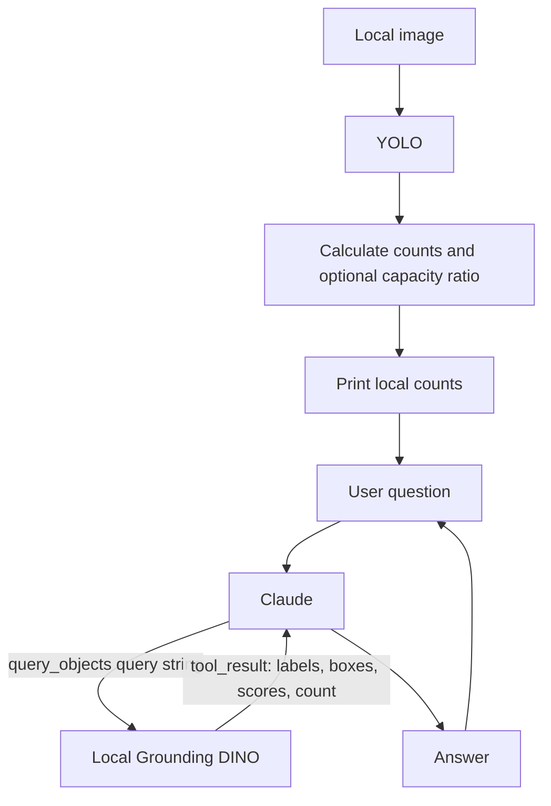

# Image-query architecture

The application has two phases. A LangGraph pipeline counts objects locally;
a conversation then lets Claude request additional local searches on demand.

## Components

- `demo.py` loads `.env`, validates inputs, runs counting once, prints the result,
  and starts interactive chat or answers a single positional question.
- `graph.py` orchestrates `START → detect → calculate → explain → END` with LangGraph.
- `steps.py` holds typed state, local YOLO inference, calculation, and a deterministic
  report. `statistics()` exposes only counts, total, capacity, and ratio to Claude.
- `devices.py` resolves auto/MPS/CUDA/CPU and rejects unavailable explicit GPUs.
- `claude.py` holds `ImageConversation`, the tool schema, and the Anthropic tool loop.
- `dino.py` loads/caches Grounding DINO, runs text-prompted inference, validates and
  clips candidate boxes, and suppresses duplicate boxes with the same label.

YOLO counts cars, people, trucks, buses, and motorcycles. People are excluded from
vehicle totals. Missing capacity produces unknown occupancy; ratios over 100%
are flagged, not clamped. No descriptions or automatic weapon searches run.

## Conversation and tools

Each session binds one image and one set of YOLO statistics. Claude receives the
statistics as context. A question about another object can produce a `tool_use`
block for `query_objects` with a `query` string of at most 200 characters.
The application runs DINO on the bound local image and returns a matching
`tool_result`, then requests Claude's answer. Multiple calls in one response
receive results together, each matched by `tool_use_id`.

Complete question/answer turns retain text, tool requests, and results in memory.
Failed turns are not committed, so a retry does not inherit an incomplete tool
exchange. Each question is limited to five model rounds and eight tool calls.
Unknown tools and invalid inputs return tool errors; detector failures are errors,
not empty detections. Truncated or empty answers fail explicitly. API errors are
reported without exposing credentials. There is no persisted chat history.

The image is decoded with EXIF orientation before both detectors. DINO's query is
normalized with a trailing period. It uses inference mode on the selected device.
The model cache key is `(model_id, local_files_only, device)` (two entries).
No matches returns an empty list even when Transformers decodes an empty token
batch as one empty label. Nonempty malformed results still fail validation.

## Data and offline behavior

Claude receives user text, YOLO statistics, and DINO query results, including
pixel boxes. No image/crop bytes or local paths are sent. The LLM cannot select
another file, model, threshold, or device through the tool schema. Object searches
are local; model download requests may occur at first use.

`--offline` runs only local YOLO and reporting. It requires local YOLO weights,
but neither Claude credentials nor DINO model files. In online mode, missing API
credentials do not prevent counting; they prevent follow-up questions.

The models may miss or misclassify objects. Candidate counts are not verified
object counts, scores are not calibrated probabilities, and zero results do not
establish absence. The LLM is instructed to use existing YOLO counts for cars and
people and to query before making claims about other objects.
