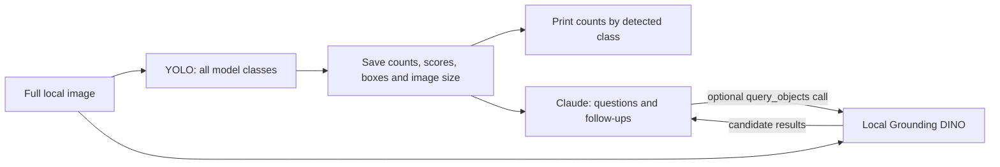

# Count objects, then ask about the image

YOLO first reports counts for every class it detects in a local image. The current
`yolo26x.pt` weights support 80 classes; custom weights use their own class list.
All detections above the confidence threshold are retained, including backpacks,
bicycles, phones, animals, and other supported objects. You can then ask Claude
about those results or request another search.
Claude has a `query_objects` tool that runs Grounding DINO locally with a text prompt
such as `bicycle. backpack.` and returns candidate labels, scores, and pixel boxes.
There is no automatic weapon scan or per-person/car image-description stage.



YOLO runs once per session. Claude receives saved results on every turn; DINO
searches the **whole image** only when its tool is called. See
[the architecture diagrams and state reference](ARCHITECTURE.md) for the runtime
flow, tool-call sequence, local/API boundaries, and offline behavior.

## Run on your Mac

Requires Python 3.11+ and uv. From this repository:

```sh
uv sync
uv run python demo.py --image sample_images/cctv_carjacking.jpg --device mps
```

Set `ANTHROPIC_API_KEY` in `.env` next to `demo.py` to enable questions. On a fresh
checkout, copy `.env.example` to `.env`. Shell variables take precedence.
`ANTHROPIC_MODEL` or `--model` selects the Claude model.

The terminal prints the total number of detections and a separate count for each
class found, then prompts. Classes with zero detections remain in state but are
omitted from the printed class list. If none are found, it prints an explicit
no-detections message.

For `cctv_carjacking.jpg`, the verified MPS run printed:

```text
YOLO: 7 object(s) across 3 detected class(es).
  car: 2
  person: 3
  truck: 2
```

With an API key configured, continue in the same terminal:

```text
You> Are there any bicycles?
You> Look for backpacks too.
You> How many people did YOLO find?
You> quit
```

Follow-up questions retain the conversation and tool results for this image.
These results live in memory for the session; they are not saved across restarts.
State retains YOLO counts and each detection's label, confidence, and pixel box,
plus the oriented image dimensions. Claude receives these saved results on every
turn, so it can answer count and location questions for any detected class without
repeating YOLO. DINO is available for objects YOLO missed, unsupported classes,
and additional searches you request.
YOLO runs only once per session. DINO loads only when Claude requests its tool;
model weights are cached in memory for later queries. Type `quit`, `exit`, Ctrl-D,
or Ctrl-C at the prompt to finish.

For a single question and then exit:

```sh
uv run python demo.py "Are there any backpacks?" --image sample_images/cars_and_people.jpg --device mps
```

For counts entirely locally, without an API key or any Claude/DINO call:

```sh
uv run python demo.py --image sample_images/cars_and_people.jpg --offline --device mps
```

Offline mode requires existing YOLO weights (`--yolo-model ./yolo26x.pt`). It does
not require cached DINO files. Questions require online Claude access; without a
key, the default command still prints local counts and explains how to enable chat.

## Models and data

`--device auto` (the default) selects Apple GPU/MPS, then CUDA, then CPU.
`--device mps` requires Mac GPU support; `--device cpu` explicitly uses the CPU.
Both detectors use the selected device. See [PyTorch MPS](https://docs.pytorch.org/docs/stable/notes/mps.html).

YOLO defaults to `yolo26x.pt`; override with `--yolo-model` and adjust its threshold
with `--confidence` (default 0.25). Grounding DINO defaults to
`IDEA-Research/grounding-dino-tiny`; `--dino-model` also accepts a local model directory.
`--dino-threshold` defaults to 0.35 and `--dino-text-threshold` to 0.25.
First use may download missing model files. The former `--weapon-threshold`,
`--weapon-text-threshold`, and `--sharpen-crops` flags have been removed.

Images stay local. Claude receives questions, saved YOLO detections and statistics,
and DINO query results (labels, scores, boxes), not images, crops, local paths, or credentials.
DINO searches the full EXIF-oriented image and does not receive a path from Claude.
Tool execution follows [Claude's tool-use protocol](https://platform.claude.com/docs/en/agents-and-tools/tool-use/overview).

Counts and matches can be wrong. Zero matches do not prove absence. Scores are
not calibrated probabilities, and combined labels may not identify a subtype.
This is an object-search demo, not a crime, intention, or identity classifier.

Optional `--capacity 50` reports a detected-vehicle / supplied-capacity ratio;
people do not contribute. Capacity must refer to the pictured area. This is not
a verified count of occupied or available spaces. Omit capacity when unknown.

## Development

```sh
uv run python -m unittest -q
```

Tests cover the actual LangGraph counting flow, local detection boundaries,
device selection, and Claude tool calls with mocked models/API responses.
See [ARCHITECTURE.md](ARCHITECTURE.md) and [sample sources](sample_images/README.md).
